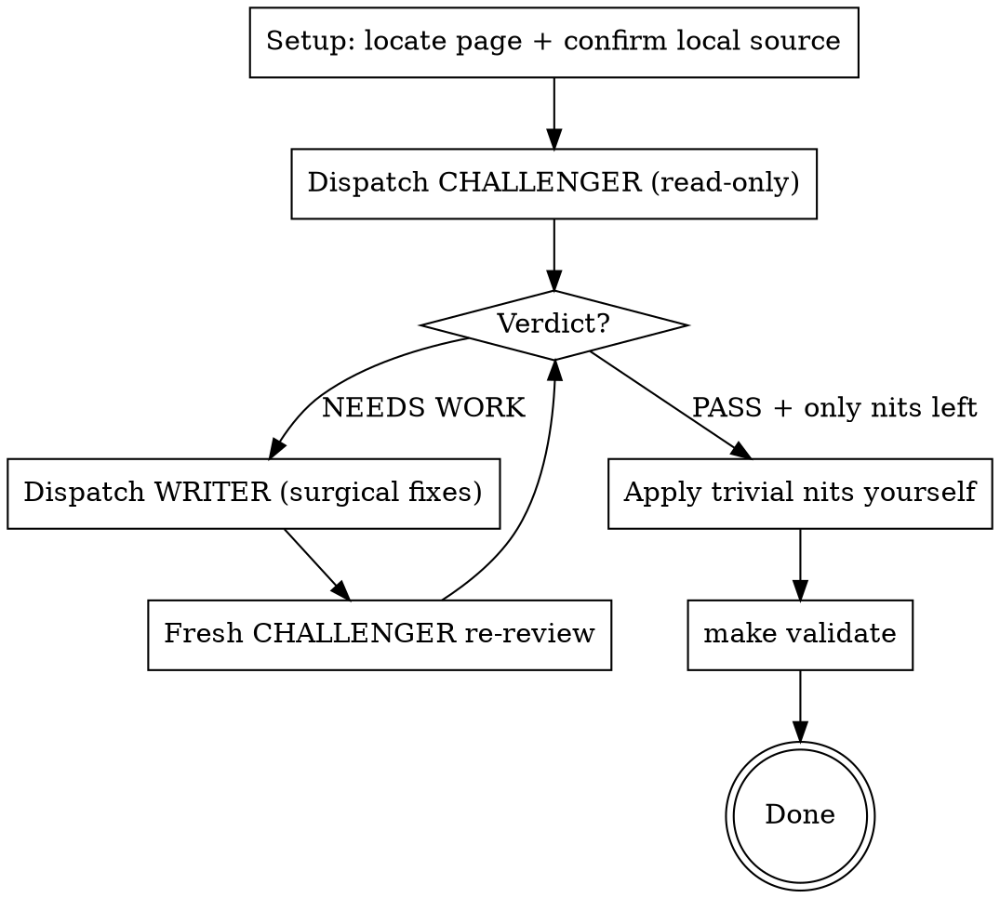

# Reviewing Source-First Pages

## Overview

Harden one existing feature page with an **adversarial review loop**: an independent challenger
attacks it, a writer fixes only what the challenger found, a fresh challenger re-attacks — repeat
until it passes on **two axes at once**: 資訊正確 (every claim matches the pinned local source) and
好懂 (a reader who knows nothing about the subsystem can follow it).

This is the review counterpart to `../source-first-topic-page/SKILL.md`. That skill writes a page;
this one pressure-tests one that already exists. The pinned local source tree is the single source
of truth — docs, memory, and the page's own prose cannot justify a claim by themselves.

## When to Use

- "review / 把關 / 挑戰 / 校稿 this page", "make sure it's correct and readable", before committing a page.
- A page whose whole premise is source-first (cites `File: path (line N)` blocks) and must stay honest.
- A report / experiment / decision page that must read as a **self-contained report a manager can
  read** ("單看這一頁就完整了解 緣起→來龍去脈→要做的事→過程細節→結論") — this invokes the Axis 2
  escalation below.

When NOT to use: writing a brand-new page (`../source-first-topic-page`), or a pure copy-edit with no
correctness stakes (just edit it).

## Required Inputs

- **Page path**: the `next-site/content/{project}/features/{slug}.mdx` under review.
- **Pinned source**: the local submodule path(s) the page cites + the tag/commit each is pinned to
  (e.g. `node_exporter/` @ v1.11.1, `linux/` @ 6.8.0-52). Confirm they are checked out locally
  BEFORE reviewing — if missing, init the submodule or stop and ask. A reviewer that cannot read
  source can only guess, which defeats the skill.
  - **Scope**: a tree is *required* only if the page actually cites it. List deeper trees (e.g. the
    kernel) as "available if a claim chases into them", not as mandatory reads.
  - **No declared pin?** If a cited submodule has no `branch`/tag in `.gitmodules`, the pin is the
    checked-out gitlink commit — record that commit (`git -C {sub} rev-parse --short HEAD`) and tell
    the challenger to verify line numbers against it, not against GitHub HEAD.
- **Project rules**: the never-translate list + zh-TW/zero-fab/ASCII rules from `AGENTS.md`/`CLAUDE.md`.

## The Loop

Track iterations with TodoWrite. Dispatch agents with the `Agent` tool.

1. **Setup.** Locate the page. Confirm every cited source tree is checked out locally and note its
   pinned tag/commit. Read the page yourself once so you can judge convergence.

2. **Challenger (RED).** Dispatch the **Devils Advocate** agent (read-only: Read/Grep/Glob) using
   `references/reviewer-prompt.md`. It must verify every claim against source on Axis 1 and stand in
   for a clueless beginner on Axis 2, then return `PASS`/`NEEDS WORK` with prioritized findings.
   If the page is a report/experiment/decision page, fill the prompt's `{MANAGER_BAR}` slot (the
   five-element self-contained bar); otherwise delete it. Fill `{DISMISSED_FALSE_ALARMS}` with any
   findings you verified false in a prior round (or "none").
   If the Devils Advocate agent is unavailable, use `general-purpose` — the framing is in the prompt.

3. **Writer (GREEN).** If `NEEDS WORK`, dispatch the **Technical Writer** agent using
   `references/writer-prompt.md`. Paste the challenger's findings verbatim AND its "what's strong"
   list as a do-not-touch list. The writer makes the smallest change per finding and must not alter
   any verified code block or `File:` line citation.

4. **Re-review independently.** Dispatch a **fresh** challenger (not a continuation) to confirm each
   fix landed, check for regressions, and audit every NEW clause the writer added for fresh
   fabrication or jargon. Re-read the whole page for independence; at minimum re-verify EVERY
   `File:`-cited block (a regression sweep) plus the changed regions.

5. **Loop** steps 3–4 until the challenger returns `PASS`. Do not declare done on your own authority —
   the passing verdict comes from the challenger. Two stopping rules:
   - A `NEEDS WORK` verdict whose findings are **only 💭 nits** counts as effectively PASS — apply
     the nits (step 6) instead of spending another writer round.
   - **Cap at ~3 writer/review rounds.** If it hasn't converged by then, or two challengers disagree
     on a substantive point, stop and escalate to the user with the specific disagreement — don't
     loop forever on borderline taste.

6. **Nits yourself.** Once it is `PASS` (or nits-only), apply the cheap ones yourself. Self-apply
   ONLY pure wording/gloss/typo fixes that add NO new factual claim and touch NO `File:`-cited block.
   Anything that introduces a factual clause or edits cited content goes back through the writer + a
   re-review — a 3-word gloss does not justify another full round, but a new sentence about behavior does.

7. **Validate.** **You (the orchestrator) run `make validate`** — not a review agent (the challenger
   is read-only and has no Bash). It must exit 0 before you report done.

## The Two Axes

| Axis | Question | How the challenger checks it |
|------|----------|------------------------------|
| 資訊正確 | Does every claim match the pinned source? | Read/Grep the local submodule; check each `File:` citation, constant, symbol, derivation. Any invented name = defect. |
| 好懂 | Can a non-expert follow it? | Read as someone who knows nothing; flag jargon-before-definition, logic leaps, bad ordering, opaque sentences. |

A page that is correct but unreadable fails. A page that is readable but wrong fails harder.

### Axis 2 escalation — the self-contained manager bar (report / experiment / decision pages)

When the page reports an **experiment, investigation, or recommendation** (not a pure code
walkthrough) — or when the user asks for "a report a manager can read", "單看這一頁就完整了解",
"來龍去脈 + 結論" — 好懂 escalates to a stronger, explicit bar. Pass it to the challenger (the
reviewer prompt has a slot): **a reader who knows none of the details must read THIS PAGE ALONE,
top to bottom, and reconstruct all five of:**

1. **緣起 (why / motivation)** — why was this done? what question or risk prompted it?
2. **來龍去脈 (context)** — how it fits the bigger picture; what was already known going in.
3. **要做的事 (what)** — what it sets out to do.
4. **過程細節 (how, concretely)** — enough method/setup that the reader trusts the result isn't an artifact.
5. **結論 (bottom line + caveats)** — the answer, reachable fast (bottom-line-first).

Background *knowledge* (what jitter / PLL / netem is) MAY be delegated to linked pages — but the
*narrative thread* (why → context → what → how → result → conclusion) must be self-contained on
this page. **If the challenger, reading only the page, cannot confidently reconstruct any one of the
five, the verdict is `NEEDS WORK`** — and it must name which of the five broke and where. A
load-bearing term used before it is defined (e.g. a result-table column the reader can't decode)
breaks bar #4 even if everything else is present.

## Constraints Every Subagent Must Receive

Both prompt templates already carry these — keep them, because a subagent without them will "fix"
the wrong things:

- zh-TW Taiwan wording; never-translate terms stay English (gloss in parens on first use is the goal).
- Zero fabrication: every code-ish name must exist in source.
- ASCII diagrams only; no Mermaid; no MDX component imports; no quiz in MDX.
- **Do NOT flag the deliberate choices above as defects** — the #1 way a naive reviewer wastes a round.

## Common Mistakes

- **Trusting the prose instead of source.** If the reviewer didn't open the submodule, the review is
  worthless. Confirm source is local first.
- **Letting the writer drift facts while "improving clarity."** The writer gets an explicit
  preserve-list and may not touch verified code blocks or line numbers. Re-verify in step 4.
- **Stopping after one pass.** One reviewer + one rewrite is not the loop. Re-review with a fresh
  challenger; a writer's edits can introduce new errors.
- **Same agent re-reviews its own changes.** Use a fresh challenger for independence.
- **Spawning a full round for a typo.** Apply trivial nits yourself (step 6).
- **Reviewing only one axis.** Correct-but-opaque and readable-but-wrong both fail.
- **Acting on a challenger finding without verifying it yourself.** Challengers produce false
  alarms — e.g. "the data tree is missing" when it is committed (a Glob/tooling miss), or "this
  number is wrong" when it compared the wrong artifacts. Before you hand a 🔴 to the writer, the
  orchestrator confirms it against source/data. **Dismiss verified-false findings — and tell the
  NEXT challenger about each dismissed false alarm** (in its prompt) so it does not re-raise it and
  burn a round.
- **Blindly applying a challenger's "should be X."** A numeric correction may be a *different
  measurement* (e.g. probe-failure-rate vs ping-loss-rate are both "loss" but different instruments).
  Trace each number to its committed artifact before changing the page; cite both if both are real.
- **(data / experiment pages) A page number with no committed artifact behind it.** If a figure was
  hand-computed and lives in no committed file, it is unreproducible — the challenger should flag it,
  and the fix is to commit the artifact (or a regenerated summary) and cite it. The phrase
  "已 commit 進 repo" on the page must actually be true; spot-check the cited results path exists.

## Completion Criteria

Finish only when:

- The latest **independent** challenger returned `PASS`.
- No verified code block or `File:` line citation was altered by the rewrites (re-verified).
- Any remaining items are explicitly non-blocking nits (applied or consciously deferred).
- `make validate` passes.
- The final response lists: iterations run, what changed, and the source files the claims were
  checked against.
